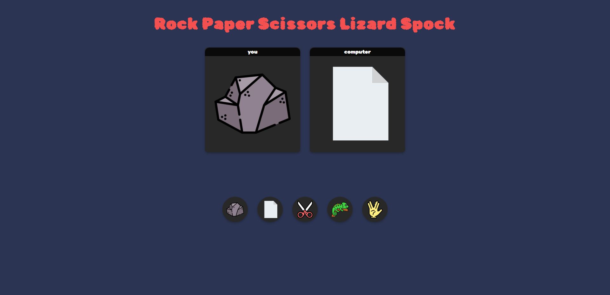
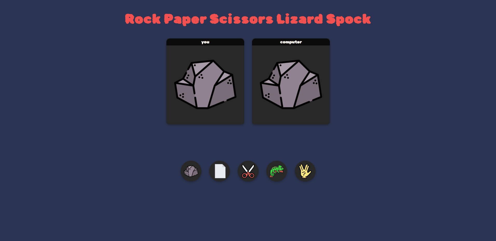

# Rock Paper Scissors Lizard Spock Game

This is a web-based game built using HTML, CSS, and JavaScript. 
It a game of chance that expands of the classic Rock Paper Scissors game, inspired by the TV show "The Big Bang Theory."
It is first used to settle a dispute about what to watch on TV between Sheldon and Raj in "The Lizard-Spock Expansion" Episode.

## Overview

## Demo
> This gif shows a brief overview of the project, and it may take a while to load!

## Rules Of The Game
- Scissors cuts Paper
- Paper covers Rock
- Rock crushes Lizard
- Lizard poisons Spock
- Spock smashes Scissors
- Scissors decapitates Lizard
- Lizard eats Paper
- Paper disproves Spock
- Spock vaporizes Rock
(and as it always has) Rock crushes Scissors
> This is an image to illustrate more.

## Getting Started
To clone and run this project locally, follow these steps:
- Clone the Repository: git clone https://github.com/mohammedamcs/rock-paper-scissor-lizard-spock-game.git
- Navigate to the project directory: cd rock-paper-scissor-lizard-spock-game
- Open the index.html file in your preferred web browser.

